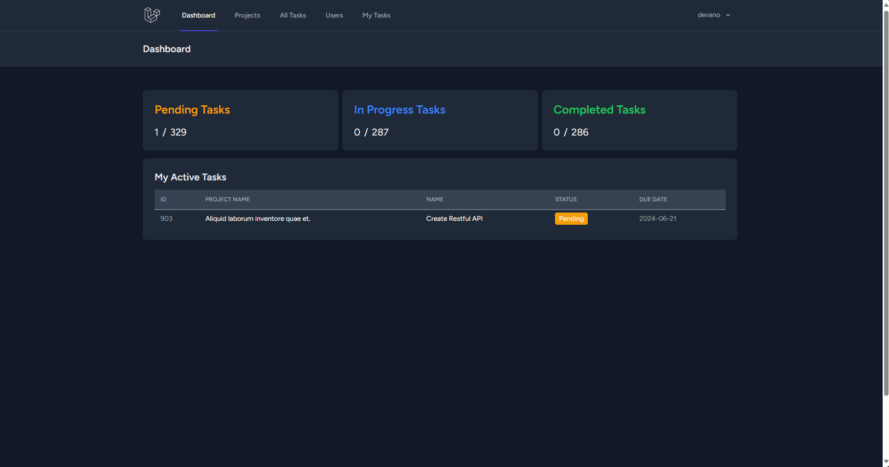
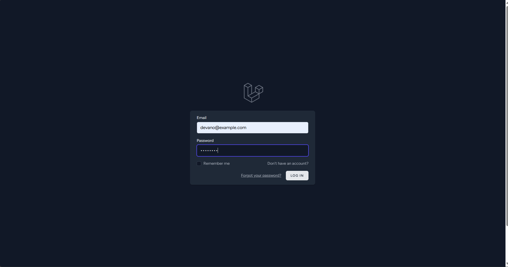
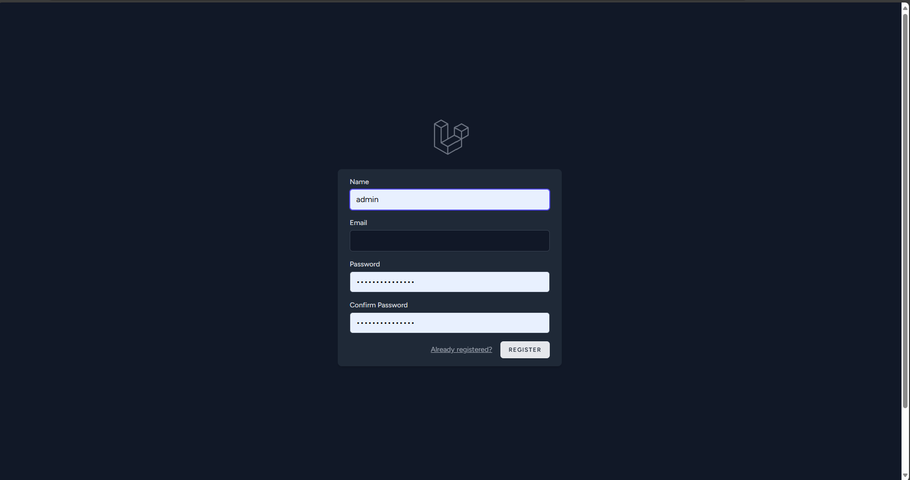
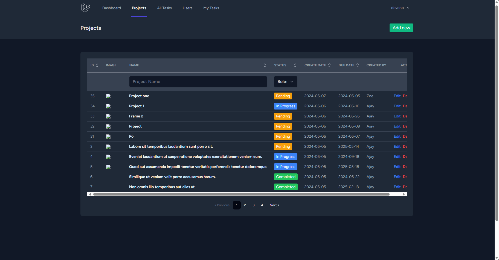
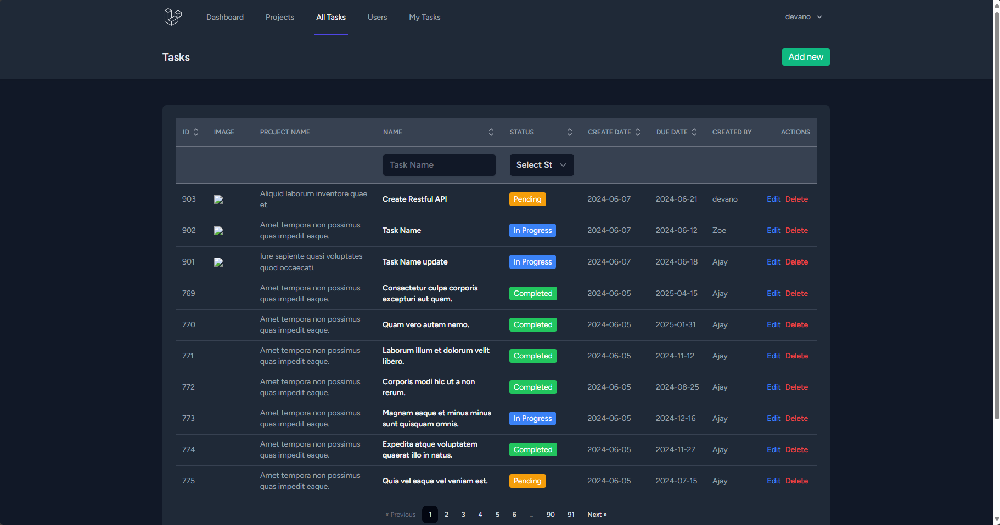
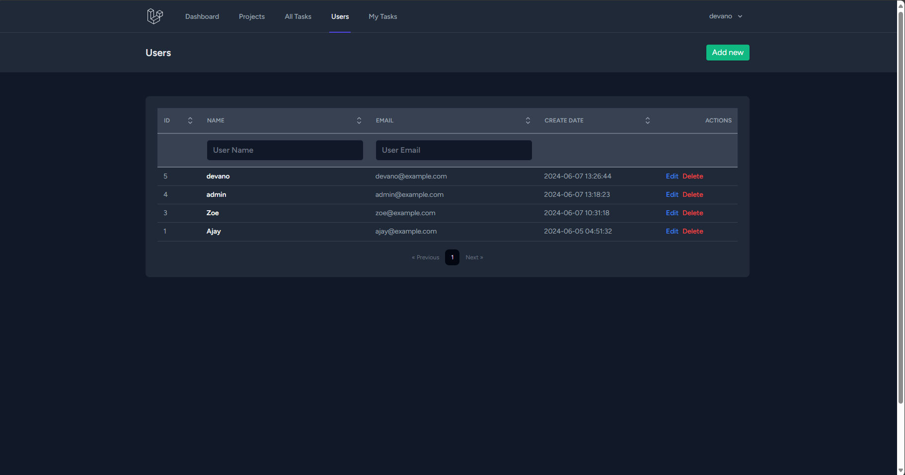
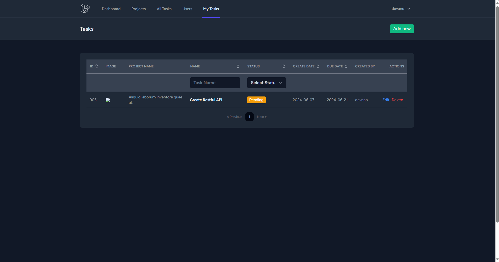
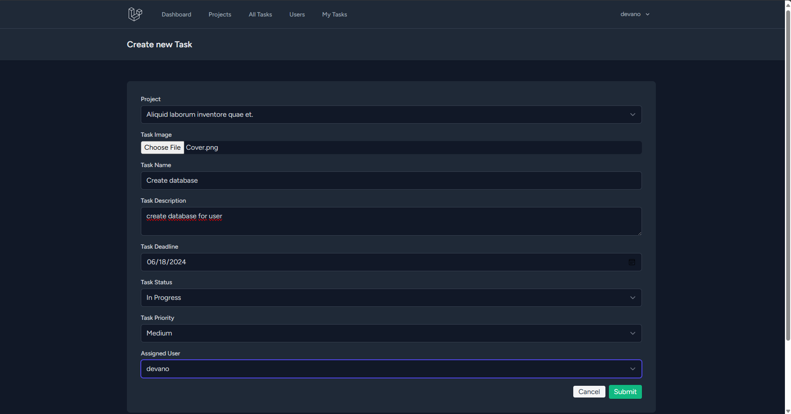
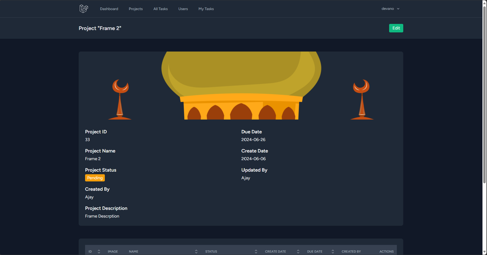

# Project Management App
Sebuah aplikasi website untuk mengelola list proyekan dalam sebuah tim untuk kepentingan pekerjaan dan pembagian tugas untuk masing - masing orang yang terlibat dalam proyekan tersebut


## Daftar Isi
- [Tumpukan Teknologi](#tumpukan-teknologi)
- [Fitur](#fitur)
- [Dokumentasi Halaman](#dokumentasi-halaman)
- [Cara Instalasi](#cara-instalasi)
- [Cara Penggunaan](#cara-penggunaan)

## Tumpukan Teknologi
### Frontend
- **ReactJS**: Perpustakaan UI untuk membangun antarmuka pengguna
- **Tailwind CSS**: Kerangka kerja CSS berbasis utilitas
- **Vite**: Alat pengembangan front-end generasi berikutnya untuk pengembangan yang lebih cepat

### Backend
- **Laravel 11**: Kerangka kerja PHP untuk pengembangan web yang elegan dan ekspresif
- **Laravel Breeze**: Alat yang ringan untuk membuat aplikasi Laravel dengan autentikasi default yang sederhana

### DBMS
- **MySQL**: Sistem manajemen basis data relasional open-source

## Fitur
- **Login**: masuk ke halaman dengan otentikasi
- **Registrasi**: membuat akun sebelum masuk ke halaman utama
- **Lupa Password**: penggguna dapat mengganti password penggunannya apabila lupa dengan mengirimnya ke email pengguna
- **Remember Me**: pengguna juga dapat mengingat data loginnya apabila setelah login tiba - tiba keluar agar tidak perlu repot mengisi email dan passwordnya selama waktu login belum berakhir
- **Logout**: pengguna dapat keluar dari akun
- **Projekan**: kita dapat menambah, mengubah, menghapus, dan melihat detail dari projekan yang sedang ada
- **Tugas**: pengguna dapat menambah, mengubah, menghapus, dan  melihat list tugas yang sedang dikerjakan oleh masing - masing pengguna / anggota proyekannya
- **Pengguna**: kita juga dapat menambah, mengubah, menghapus, dan  melihat secara detail user yang ada

## Dokumentasi Halaman
##### 1. Halaman Dashboard Utama

##### 2. Halaman Login

##### 3. Halaman Registrasi

##### 4. Halaman Dashboard Utama

##### 5. Halaman List Proyekan

##### 6. Halaman List Tugas

##### 7. Halaman List Pengguna

##### 8. Halaman Pembuatan tugas pengguna

##### 9. Halaman Detail Tugas Pengguna


## Cara Instalasi
```bash
# Clone repository ini
git clone https://github.com/defrijay/project-management-app.git

# Masuk ke direktori proyek
cd project-management-app

# Nyalakan apache dan mysql modulenya

# Import databasenya menggunakan phpmyadmin atau sejenisnya

# Instal dependensi
npm install

# Jalankan server artisan
php artisan serve

# Jalankan server frontendnya secara live
npm run dev --watch

# Buka url server artisannya
http://localhost:8000/

```

## Cara Penggunaan
1. Lakukan otentikasi dengan login pengguna. Apabila belum punya akun registrasi dulu. Namun, kamu dapat mencoba menggunakan akun `devano@example.com` dengan password `123.321A`.
2. Masuk ke My Tasks dan klik `add new` untuk membuat proyekan baru.
3. Isi form datanya dan laukan `submit` apabila sudah terisi semua
4. Apabila kamu ingin mengeditnya klik `edit` dan `delete` untuk menghapusnya.
5. Namun kamu juga dapat melihat datanya dengan mengklik teks proyekannya.

##### ***catatan**
Apabila ingin mengupload gambar pastikan ukurannya dibawah 100kb


